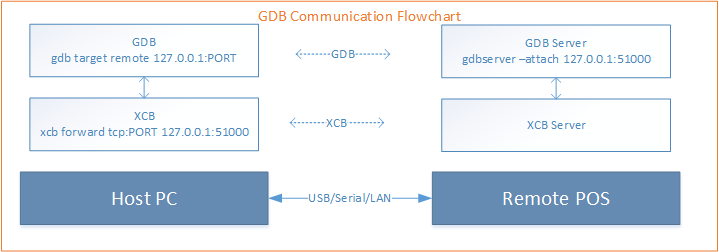

# <center>Prolin Program Debug</center>

# 1 Introduction

This document describes how to use GDB to debug Prolin applications.

## 1.1 About GDB

GDB is short for **GNU Project Debugger**, which is used to debug running local or remote programs. It can be downloaded from https://sourceware.org/gdb/.

## 1.2 Prolin GDB Communication Flow

Prolin applications support GDB debugging. The communication between GDB Clinet on the host and GDB Server on the POS terminal needs to be forwarded by  **xcb**.




## 1.3 Check GDB

Prolin GDB, as well as GCC, is located in the GNU tool chain directory. According to the system information (TM-Terminal Info - GCC VSERSION) of the POS currently in use, you can select either version 4.6.3 or 8.3.0 of GDB. For example, version 8.3.0 of GDB is located in the `toolchains/arm-8.3.0/bin` directory.

Before using GDB, you should check and test if GDB is available.

```sh
$ arm-none-linux-gnueabi-gdb.exe --version
GNU gdb (crosstool-NG 1.24.0) 8.2.1
Copyright (C) 2018 Free Software Foundation, Inc.
License GPLv3+: GNU GPL version 3 or later <http://gnu.org/licenses/gpl.html>
This is free software: you are free to change and redistribute it.
There is NO WARRANTY, to the extent permitted by law.
```

If the `arm-none-linux-gnueabi-gdb.exe` command does not run properly (crashes or just exits) on Windows OS, then you need to set it to run in **Compatibility Mode**.

# 2 Write debugging code

You need to modify the source code of the target program to support debugging it with GDB.

## 2.1 Function for debugging

Add a function for debugging. The code snippet is as follows.

```c
int start_debug()
{
	int ret = 0;
	pid_t mypid;
	pid_t pid;
	char idstr[16];
	mypid = getpid();
	pid = vfork();
	/* child */
	if (pid == 0) {
		snprintf(idstr, sizeof(idstr), "%u", (unsigned int)mypid);
		/* set TCP/IP port to default value 51000 */
		execlp("gdbserver", "gdbserver", "--attach", "127.0.0.1:51000", idstr, NULL);
		exit(127);
	}
	/* parent */
	else if (pid > 0) {
		/* wait for attached by gdbserver */
		sleep(5);
	}
	else {
		ret = -1;
	}
	return ret;
}
```

## 2.2 Invoke debugging function

invoke the debugging function in the **main** function.

```c
int main()
{
	int a = 2;
	int b = 3;
	int c = a + b;
	start_debug(); // call debug function in main
	printf("%d+%d=%d\n", a, b, c);
	a = a + b;
	c = a + b;
	printf("%d+%d=%d\n", a, b, c);
	b = a + b;
	c = a + b;
	printf("%d+%d=%d\n", a, b, c);
	return 0;
}
```

# 3 Debug

## 3.1 Build the application and make a package

Use the following windows batch script to build and package the application.

```sh
set APP=PosDemo
set SDK_PATH=%cd%/sdk
set TOOLS_PATH=%SDK_PATH%/tools/msys/bin
set PATH=%PATH%;%SDK_PATH%;%TOOLS_PATH%
cd %APP%
cd default
make clean
make
cd ..
zip pkg/%APP%.aip -r -x default/* -@ < pkginfo && zip pkg/%APP%.aip default/%APP% -j
cd ..
```

The build process is as follows.

```tex
D:\gdb>build.bat

D:\gdb>set APP=PosDemo

D:\gdb>set SDK_PATH=D:\gdb/sdk

D:\gdb>set TOOLS_PATH=D:\gdb/sdk/tools/msys/bin

D:\gdb>set PATH=C:\Program Files\Common Files\Oracle\Java\javapath;C:\Windows\system32;C:\Windows;D:\gdb/sdk;D:\gdb/sdk/tools/msys/bin

D:\gdb>cd PosDemo

D:\gdb\PosDemo>cd default

D:\gdb\PosDemo\default>make clean
PosDemo
D:\gdb/sdk/platforms/prolin-dev-4.6.3
D:\gdb/sdk/toolchains/arm-4.6.3
rm -rf ./src/debugger.o ./src/main.o app.nostrip  PosDemo


D:\gdb\PosDemo\default>make
PosDemo
D:\gdb/sdk/platforms/prolin-dev-4.6.3
D:\gdb/sdk/toolchains/arm-4.6.3
Building file: ../src/debugger.c
Invoking: GCC Compiler
"D:\gdb/sdk/toolchains/arm-4.6.3/bin/arm-none-linux-gnueabi-gcc" -O0 -g2 -Wall -funwind-tables -I"../inc" -I"../src" -I"D:\gdb/sdk/platforms/prolin-dev-4.6.3/include" -I"D:\gdb/sdk/platforms/prolin-dev-4.6.3/include/freetype2" -I"D:\gdb/sdk/toolchains/arm-4.6.3/arm-none-linux-gnueabi/libc/usr/include" -I"D:\gdb/sdk/toolchains/arm-4.6.3/lib/gcc/arm-none-linux-gnueabi/4.6.3/include" -c -o "src/debugger.o" "../src/debugger.c"
bash.exe: warning: could not find /tmp, please create!
Finished building: ../src/debugger.c

Building file: ../src/main.c
Invoking: GCC Compiler
"D:\gdb/sdk/toolchains/arm-4.6.3/bin/arm-none-linux-gnueabi-gcc" -O0 -g2 -Wall -funwind-tables -I"../inc" -I"../src" -I"D:\gdb/sdk/platforms/prolin-dev-4.6.3/include" -I"D:\gdb/sdk/platforms/prolin-dev-4.6.3/include/freetype2" -I"D:\gdb/sdk/toolchains/arm-4.6.3/arm-none-linux-gnueabi/libc/usr/include" -I"D:\gdb/sdk/toolchains/arm-4.6.3/lib/gcc/arm-none-linux-gnueabi/4.6.3/include" -c -o "src/main.o" "../src/main.c"
bash.exe: warning: could not find /tmp, please create!
Finished building: ../src/main.c

Invoking: GCC Linker
"D:\gdb/sdk/toolchains/arm-4.6.3/bin/arm-none-linux-gnueabi-gcc" -o"app.nostrip" ./src/debugger.o ./src/main.o    -L"D:\gdb/sdk/platforms/prolin-dev-4.6.3/lib" -Wl,-rpath=//opt/lib -Wl,-rpath=./lib -Wl,-rpath-link,"D:\gdb/sdk/platforms/prolin-dev-4.6.3/lib" -losal -lcrypto -lfreetype -lpng -lpthread -lts -lxui -L"../lib"
bash.exe: warning: could not find /tmp, please create!
Finished building: app.nostrip

Building target: PosDemo
Invoking: GCC Strip
"D:\gdb/sdk/toolchains/arm-4.6.3/bin/arm-none-linux-gnueabi-strip" -g app.nostrip  -o"PosDemo"
bash.exe: warning: could not find /tmp, please create!
Finished building target: PosDemo

D:\gdb\PosDemo\default>cd ..

D:\gdb\PosDemo>zip pkg/PosDemo.aip -r -x default/* -@   0<pkginfo  && zip pkg/PosDemo.aip default/PosDemo -j
updating: appinfo (172 bytes security) (deflated 11%)
updating: bin/ (260 bytes security) (stored 0%)
updating: lib/ (260 bytes security) (stored 0%)
updating: res/ (260 bytes security) (stored 0%)
updating: PosDemo (172 bytes security) (deflated 58%)

D:\gdb\PosDemo>cd ..
```

## 3.1  Install and Run the Application

Install the application into the POS.

```sh
$ xcb connect com:COM7
$ xcb devices
$ xcb installer aip PosDemo/pkg/PosDemo.aip
```

Start the application by operating the POS device. At this point the application is in a debugging state, and it will not respond to external interactions.

## 3.2 Execute the Debug Command

Execute the GDB command:

```sh
$ xcb forward tcp:51000 tcp:51000
$ sdk\toolchains\arm-4.6.3\bin\arm-none-linux-gnueabi-gdb.exe
(gdb) file PosDemo/default/app.nostrip
(gdb) b main
(gdb) target remote 127.0.0.1:51000
(gdb) c
(gdb) quit
```

As mentioned previously in the GDB communication flow, port forwarding is required before debugging. Therefore, you need to find a free port of the host. For example, if the idle port number you find is 50037, then the command is:

```sh
$ xcb forward tcp:50037 tcp:51000
...
$ (gdb) target remote 127.0.0.1:50037
```

The following is a simple example of GDB execution on windows.

```tex
D:\gdb>xcb forward tcp:51000 tcp:51000
D:\gdb>sdk\toolchains\arm-4.6.3\bin\arm-none-linux-gnueabi-gdb.exe
GNU gdb (Sourcery CodeBench Lite 2012.03-57) 7.2.50.20100908-cvs
Copyright (C) 2010 Free Software Foundation, Inc.
License GPLv3+: GNU GPL version 3 or later <http://gnu.org/licenses/gpl.html>
This is free software: you are free to change and redistribute it.
There is NO WARRANTY, to the extent permitted by law.  Type "show copying"
and "show warranty" for details.
This GDB was configured as "--host=i686-mingw32 --target=arm-none-linux-gnueabi".
For bug reporting instructions, please see:
<https://support.codesourcery.com/GNUToolchain/>.
(gdb) file PosDemo/default/app.nostrip
Reading symbols from d:\gdb\posdemo\default\app.nostrip...done.
(gdb) b main
Breakpoint 1 at 0x87e8: file ../src/main.c, line 6.
(gdb) b 10
Breakpoint 2 at 0x880c: file ../src/main.c, line 10.
(gdb) b 12
Breakpoint 3 at 0x8834: file ../src/main.c, line 12.
(gdb) b 14
Breakpoint 4 at 0x885c: file ../src/main.c, line 14.
(gdb) b 16
Breakpoint 5 at 0x887c: file ../src/main.c, line 16.
(gdb) target remote 127.0.0.1:51000
Remote debugging using 127.0.0.1:51000
warning: Could not load shared library symbols for 16 libraries, e.g. /usr/lib/libosal.so.
Use the "info sharedlibrary" command to see the complete listing.
Do you need "set solib-search-path" or "set sysroot"?
warning: Unable to find dynamic linker.
GDB will be unable to debug shared library initializers
and track explicitly loaded dynamic code.
0x4053d1cc in ?? ()
(gdb) c
Continuing.

Breakpoint 2, main () at ../src/main.c:10
10              printf("%d+%d=%d\n", a, b, c);
(gdb) c
Continuing.

Breakpoint 3, main () at ../src/main.c:12
12              c = a + b;
(gdb) c
Continuing.

Breakpoint 4, main () at ../src/main.c:14
14              b = a + b;
(gdb) c
Continuing.

Breakpoint 5, main () at ../src/main.c:16
16              printf("%d+%d=%d\n", a, b, c);
(gdb) c
Continuing.
Remote connection closed
```

>  Note that before calling the target remote command, you need to make sure that the application on the POS is in debugging state. After finishing the current debugging, you can start the application again and call the **target remote** command to start a new debugging process.

# 4 Summary

This article describes how to debug Prolin applications on Windows using the command line.

The Prolin application code can be written in C or C++, refer to the source code of the two programs **PosDemo** and **PosCppDemo**.
