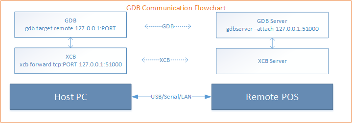

# <center>Prolin程序调试</center>

# 1 简介

本文介绍如何使用GDB调试Prolin应用程序。

## 1.1 GDB简介

GDB指GNU Project Debugger，用于调试对正在运行的本地或远程程序。可以从https://sourceware.org/gdb/下载GDB。

## 1.2 Prolin GDB通信流程

Prolin应用程序支持GDB调试。其中主机上的GDB Clinet和POS终端上的GDB Server之间进行通信时，需要使用xcb进行转发。




## 1.3 检测GDB

Prolin GDB位于GNU工具链中，与GCC同目录。根据当前使用的POS机的系统信息（TM－Terminal Info - GCC VSERSION），可选择4.6.3或8.3.0版本的GDB。例如8.3.0版本的GDB位于`toolchains/arm-8.3.0/bin`目录。

在使用GDB前，应查看并测试GDB是否可用。

```sh
$ arm-none-linux-gnueabi-gdb.exe --version
GNU gdb (crosstool-NG 1.24.0) 8.2.1
Copyright (C) 2018 Free Software Foundation, Inc.
License GPLv3+: GNU GPL version 3 or later <http://gnu.org/licenses/gpl.html>
This is free software: you are free to change and redistribute it.
There is NO WARRANTY, to the extent permitted by law.
```

如果`arm-none-linux-gnueabi-gdb.exe`命令无法正常运行（崩溃或不显示任何消息），则需要将其设置成兼容模式运行（Run the program in Compatibility Mode)。

# 2 编写代码

需要修改目标应用的源代码，才能支持使用GDB调试此应用。

## 2.1 调试接口

增加一个调试函数，代码内容如下：

```c
int start_debug()
{
	int ret = 0;
	pid_t mypid;
	pid_t pid;
	char idstr[16];
	mypid = getpid();
	pid = vfork();
	/* child */
	if (pid == 0) {
		snprintf(idstr, sizeof(idstr), "%u", (unsigned int)mypid);
		/* set TCP/IP port to default value 51000 */
		execlp("gdbserver", "gdbserver", "--attach", "127.0.0.1:51000", idstr, NULL);
		exit(127);
	}
	/* parent */
	else if (pid > 0) {
		/* wait for attached by gdbserver */
		sleep(5);
	}
	else {
		ret = -1;
	}
	return ret;
}
```

## 2.2 调用调试接口

在main函数中调试函数。

```c
int main()
{
	int a = 2;
	int b = 3;
	int c = a + b;
	start_debug(); // debug
	printf("%d+%d=%d\n", a, b, c);
	a = a + b;
	c = a + b;
	printf("%d+%d=%d\n", a, b, c);
	b = a + b;
	c = a + b;
	printf("%d+%d=%d\n", a, b, c);
	return 0;
}
```

# 3 调试

## 3.1 构建应用并打包

使用如下的windows批处理脚本构建和打包：

```sh
set APP=PosDemo
set SDK_PATH=%cd%/sdk
set TOOLS_PATH=%SDK_PATH%/tools/msys/bin
set PATH=%PATH%;%SDK_PATH%;%TOOLS_PATH%
cd %APP%
cd default
make clean
make
cd ..
zip pkg/%APP%.aip -r -x default/* -@ < pkginfo && zip pkg/%APP%.aip default/%APP% -j
cd ..
```

构建效果如下：

```tex
D:\gdb>build.bat

D:\gdb>set APP=PosDemo

D:\gdb>set SDK_PATH=D:\gdb/sdk

D:\gdb>set TOOLS_PATH=D:\gdb/sdk/tools/msys/bin

D:\gdb>set PATH=C:\Program Files\Common Files\Oracle\Java\javapath;C:\Windows\system32;C:\Windows;D:\gdb/sdk;D:\gdb/sdk/tools/msys/bin

D:\gdb>cd PosDemo

D:\gdb\PosDemo>cd default

D:\gdb\PosDemo\default>make clean
PosDemo
D:\gdb/sdk/platforms/prolin-dev-4.6.3
D:\gdb/sdk/toolchains/arm-4.6.3
rm -rf ./src/debugger.o ./src/main.o app.nostrip  PosDemo


D:\gdb\PosDemo\default>make
PosDemo
D:\gdb/sdk/platforms/prolin-dev-4.6.3
D:\gdb/sdk/toolchains/arm-4.6.3
Building file: ../src/debugger.c
Invoking: GCC Compiler
"D:\gdb/sdk/toolchains/arm-4.6.3/bin/arm-none-linux-gnueabi-gcc" -O0 -g2 -Wall -funwind-tables -I"../inc" -I"../src" -I"D:\gdb/sdk/platforms/prolin-dev-4.6.3/include" -I"D:\gdb/sdk/platforms/prolin-dev-4.6.3/include/freetype2" -I"D:\gdb/sdk/toolchains/arm-4.6.3/arm-none-linux-gnueabi/libc/usr/include" -I"D:\gdb/sdk/toolchains/arm-4.6.3/lib/gcc/arm-none-linux-gnueabi/4.6.3/include" -c -o "src/debugger.o" "../src/debugger.c"
bash.exe: warning: could not find /tmp, please create!
Finished building: ../src/debugger.c

Building file: ../src/main.c
Invoking: GCC Compiler
"D:\gdb/sdk/toolchains/arm-4.6.3/bin/arm-none-linux-gnueabi-gcc" -O0 -g2 -Wall -funwind-tables -I"../inc" -I"../src" -I"D:\gdb/sdk/platforms/prolin-dev-4.6.3/include" -I"D:\gdb/sdk/platforms/prolin-dev-4.6.3/include/freetype2" -I"D:\gdb/sdk/toolchains/arm-4.6.3/arm-none-linux-gnueabi/libc/usr/include" -I"D:\gdb/sdk/toolchains/arm-4.6.3/lib/gcc/arm-none-linux-gnueabi/4.6.3/include" -c -o "src/main.o" "../src/main.c"
bash.exe: warning: could not find /tmp, please create!
Finished building: ../src/main.c

Invoking: GCC Linker
"D:\gdb/sdk/toolchains/arm-4.6.3/bin/arm-none-linux-gnueabi-gcc" -o"app.nostrip" ./src/debugger.o ./src/main.o    -L"D:\gdb/sdk/platforms/prolin-dev-4.6.3/lib" -Wl,-rpath=//opt/lib -Wl,-rpath=./lib -Wl,-rpath-link,"D:\gdb/sdk/platforms/prolin-dev-4.6.3/lib" -losal -lcrypto -lfreetype -lpng -lpthread -lts -lxui -L"../lib"
bash.exe: warning: could not find /tmp, please create!
Finished building: app.nostrip

Building target: PosDemo
Invoking: GCC Strip
"D:\gdb/sdk/toolchains/arm-4.6.3/bin/arm-none-linux-gnueabi-strip" -g app.nostrip  -o"PosDemo"
bash.exe: warning: could not find /tmp, please create!
Finished building target: PosDemo

D:\gdb\PosDemo\default>cd ..

D:\gdb\PosDemo>zip pkg/PosDemo.aip -r -x default/* -@   0<pkginfo  && zip pkg/PosDemo.aip default/PosDemo -j
updating: appinfo (172 bytes security) (deflated 11%)
updating: bin/ (260 bytes security) (stored 0%)
updating: lib/ (260 bytes security) (stored 0%)
updating: res/ (260 bytes security) (stored 0%)
updating: PosDemo (172 bytes security) (deflated 58%)

D:\gdb\PosDemo>cd ..
```

## 3.1 安装并运行应用

将应用包安装到POS机中。

```sh
$ xcb connect com:COM7
$ xcb devices
$ xcb installer aip PosDemo/pkg/PosDemo.aip
```

操作POS机启动应用。此时应用处于调试状态，因此不会响应外部交互，并非POS卡顿。

## 3.2 执行调试命令

执行gdb命令，命令如下：

```sh
$ xcb forward tcp:51000 tcp:51000
$ sdk\toolchains\arm-4.6.3\bin\arm-none-linux-gnueabi-gdb.exe
(gdb) file PosDemo/default/app.nostrip
(gdb) b main
(gdb) target remote 127.0.0.1:51000
(gdb) c
(gdb) quit
```

如前文提到的GDB通信流程，在调试前，需要进行端口转发。因此，需要找到一个主机的空闲端口。例如，如果找到空闲端口是50037，则相关的命令是：

```sh
$ xcb forward tcp:50037 tcp:51000
...
$ (gdb) target remote 127.0.0.1:50037
```

以下是windows上简单的GDB执行示例。

```tex
D:\gdb>xcb forward tcp:51000 tcp:51000
D:\gdb>sdk\toolchains\arm-4.6.3\bin\arm-none-linux-gnueabi-gdb.exe
GNU gdb (Sourcery CodeBench Lite 2012.03-57) 7.2.50.20100908-cvs
Copyright (C) 2010 Free Software Foundation, Inc.
License GPLv3+: GNU GPL version 3 or later <http://gnu.org/licenses/gpl.html>
This is free software: you are free to change and redistribute it.
There is NO WARRANTY, to the extent permitted by law.  Type "show copying"
and "show warranty" for details.
This GDB was configured as "--host=i686-mingw32 --target=arm-none-linux-gnueabi".
For bug reporting instructions, please see:
<https://support.codesourcery.com/GNUToolchain/>.
(gdb) file PosDemo/default/app.nostrip
Reading symbols from d:\gdb\posdemo\default\app.nostrip...done.
(gdb) b main
Breakpoint 1 at 0x87e8: file ../src/main.c, line 6.
(gdb) b 10
Breakpoint 2 at 0x880c: file ../src/main.c, line 10.
(gdb) b 12
Breakpoint 3 at 0x8834: file ../src/main.c, line 12.
(gdb) b 14
Breakpoint 4 at 0x885c: file ../src/main.c, line 14.
(gdb) b 16
Breakpoint 5 at 0x887c: file ../src/main.c, line 16.
(gdb) target remote 127.0.0.1:51000
Remote debugging using 127.0.0.1:51000
warning: Could not load shared library symbols for 16 libraries, e.g. /usr/lib/libosal.so.
Use the "info sharedlibrary" command to see the complete listing.
Do you need "set solib-search-path" or "set sysroot"?
warning: Unable to find dynamic linker.
GDB will be unable to debug shared library initializers
and track explicitly loaded dynamic code.
0x4053d1cc in ?? ()
(gdb) c
Continuing.

Breakpoint 2, main () at ../src/main.c:10
10              printf("%d+%d=%d\n", a, b, c);
(gdb) c
Continuing.

Breakpoint 3, main () at ../src/main.c:12
12              c = a + b;
(gdb) c
Continuing.

Breakpoint 4, main () at ../src/main.c:14
14              b = a + b;
(gdb) c
Continuing.

Breakpoint 5, main () at ../src/main.c:16
16              printf("%d+%d=%d\n", a, b, c);
(gdb) c
Continuing.
Remote connection closed
```

> 注意，再调用target remote命令前，需要确保POS机上的应用正处于调试状态。当前调试结束后，可以再次启应用并调用target remote命令，开启新的调试。
>
# 4 小结

本文介绍了如何在Windows上使用命令行调试Prolin应用。

Prolin应用代码可以是C或C++编写的，参考PosDemo和PosCppDemo两个程序的源代码。
